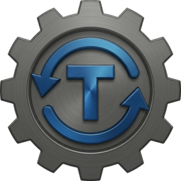

# Transcodarr

<p align="center">
  
</p>

<p align="center">
  <a href="https://ko-fi.com/H2H41XM0EP"></a>
</p>

Automated media library unification for Sonarr/Radarr. GPU-accelerated transcoding via NVIDIA NVENC with a mobile-friendly web dashboard.

Transcodarr brings your entire media library to a single, consistent quality standard — same video codec, resolution limits, audio format, and language across every file. It scans your libraries through the Sonarr/Radarr APIs, identifies files that don't match your target spec, and processes them through a multi-stage pipeline with per-disk concurrency control and space management.

## Features

- **GPU and CPU encoding** via NVIDIA NVENC, Intel QuickSync (QSV), or libx264 (H.264 output)
- **Audio transcoding** to configurable codec and channel count with language-based track selection
- **5-stage Valkey pipeline** with parallel processing and per-disk concurrency limits
- **Web dashboard** with real-time status, queue browser, disk filters, and settings management
- **Start paused by default** with play/pause control from the UI
- **Persistent config** via `config.json` with web UI settings editor and restart button
- **Direct disk I/O** bypassing FUSE for read/write performance on Unraid
- **Arr integration** via Radarr/Sonarr APIs for library scanning and post-import hooks
- **Plex notifications** after each successful transcode
- **Job-tagged logging** for traceable concurrent worker output
- **Homepage widget** support with combined status fields
- **Self-hosted icon** served from the built-in API

## Quick Start

1. Clone and configure:
```bash
git clone https://github.com/jb14813/Transcodarr.git
cd Transcodarr
cp .env.example .env
# Edit .env with your Plex, Sonarr, and Radarr credentials
```

2. Edit `docker-compose.yml`:
   - Set your media library paths (`/movies`, `/tv`)
   - Add direct disk mounts for performance (optional)
   - Adjust worker counts for your hardware

3. Build and start:
```bash
docker compose build
docker compose up -d
```

4. Open the dashboard at `http://your-server:7879`

5. Press **Resume** to start processing.

## Requirements

- Docker with NVIDIA Container Toolkit (`nvidia-docker2`)
- NVIDIA GPU with NVENC support (GTX 1050+ / RTX series)
- Sonarr and/or Radarr with API access
- Media files accessible to the container

## Access Options

### Option 1: Direct Port (simple)

Expose port 7879 directly. This is the default in `docker-compose.yml`:

```yaml
ports:
  - "7879:7879"
```

Access at `http://your-server:7879`.

### Option 2: Behind Traefik (HTTPS, recommended)

Remove the `ports` section and add Traefik labels for HTTPS access with automatic certificates:

```yaml
# No ports section needed
labels:
  - traefik.enable=true
  - traefik.docker.network=your-traefik-network
  - traefik.http.routers.transcodarr.rule=Host(`transcodarr.yourdomain.com`)
  - traefik.http.routers.transcodarr.entrypoints=websecure
  - traefik.http.routers.transcodarr.tls=true
  - traefik.http.routers.transcodarr.tls.certresolver=your-cert-resolver
  - traefik.http.services.transcodarr.loadbalancer.server.port=7879
networks:
  - your-traefik-network
```

Add any middlewares you need (IP allowlist for LAN-only, security headers, etc.):

```yaml
  - traefik.http.routers.transcodarr.middlewares=your-lan-middleware@docker,security-headers@docker
```

### Option 3: Other Reverse Proxies

Point your reverse proxy at the container's port 7879. The API serves all content (GUI, API, icons) from the same port. No special path configuration needed.

## Architecture

Transcodarr uses a 5-stage streaming pipeline backed by an embedded Valkey instance. Every stage maintains separate **import-priority queues** alongside bulk queues — newly imported files always jump ahead of the backlog.

```
Stage 1: API Intake + Job Bridge
  Bulk: Queries Radarr/Sonarr APIs, pre-filters by codec/resolution/audio
    → tc:candidates:ready
  Import: Job bridge reads .job files from arr webhooks
    → tc:candidates:import:ready (priority)

Stage 2: Probe Pool (configurable workers)
  ffprobe validation, deduplication via fingerprint, classification
  Checks import queue first, then bulk on every cycle
    → tc:gpu:ready / tc:cpu:ready (bulk)
    → tc:gpu:import:ready / tc:cpu:import:ready (priority)

Stage 3: Disk Wrangler (configurable workers)
  Resolves physical disk paths, enriches items with disk metadata and file size
  Checks import queues first, then bulk
    → tc:lb:gpu:ready / tc:lb:cpu:ready (bulk)
    → tc:lb:gpu:import:ready / tc:lb:cpu:import:ready (priority)

Stage 4: Load Balancer
  Per-disk concurrency gating, disk space checks, SSD tmp pool reservation
  Dispatches import items before bulk at every cycle
    → tc:dispatch:gpu:ready / tc:dispatch:cpu:ready

Stage 5: Workers (GPU + CPU pools)
  GPU: NVENC video re-encode + audio transcode (h264_nvenc)
  CPU: Audio-only remux when video is already H.264 (ffmpeg -c:v copy)
  Direct disk read/write with dot-prefixed temp files and atomic rename
```

### Priority Flow

When a new file is imported through Sonarr/Radarr, it enters the pipeline through the import-priority path. At every stage, workers check the import queue before the bulk queue. This means a freshly downloaded file skips ahead of thousands of queued bulk items and gets transcoded within minutes — not hours.

### File Processing

Each file goes through: scan, classify, probe, transcode, validate, replace.

- **GPU route**: Video codec is not H.264, or resolution exceeds max width/height. Full NVENC re-encode with audio transcode to target codec.
- **CPU route**: Video is already H.264 but audio needs work — wrong codec (not AAC), too many channels, wrong language, multiple tracks, or commentary-only. Video stream is copied, audio re-encoded.
- **Skip**: File already meets all video and audio specs. No processing needed.

### Audio Track Selection

The worker intelligently selects which audio track to keep:
- Finds the first track matching the configured language (default: English)
- Skips commentary tracks and descriptive audio tracks
- If only one track exists with no language tag, uses it with a warning
- If multiple tracks exist but none match the target language, the file is flagged for re-download
- Selected track is re-encoded to the target codec and channel count

### Validation

Every output file is validated before replacing the original:
- Must have at least 1 video and 1 audio stream
- Duration must match original within 10 seconds (accounts for container duration vs stream duration differences)
- Output size must be at least 5% of original (or 1MB minimum)
- Video codec must be H.264

Failed validations are logged to `failed-files.tsv` and the original file is preserved. The failed TSV is a dashboard/reporting list only; retry suppression is handled by the in-memory `tc:seen` dedupe set during a scan.

### Space Management

Transcodarr monitors disk space at three levels:
- **Space monitor**: Polls `df` on each disk mount every 30 seconds, writes per-disk free space and threshold flags to Valkey
- **Load balancer**: Won't dispatch jobs to disks below the free space threshold or below the estimated space needed by that item
- **Worker**: Pre-encode and post-encode space checks, re-queues exit-75 destination/SSD space failures instead of leaving them in a dead-end queue

## Configuration

Settings are managed through three layers:

1. **`docker-compose.yml`** environment variables set the initial defaults
2. **`config.json`** (in `/state`) is created on first run from env vars and becomes the single source of truth
3. **Web GUI** Settings tab reads and writes `config.json`

After changing settings in the GUI, press the restart button to apply. The GUI shows a banner when unapplied changes are detected and hides it if you revert to the running config.

### Settings Groups

| Group | Settings |
|-------|----------|
| **Output** | Container, quality preset, target video/audio codec, language, subtitles |
| **Video Processing** | Resolution, HDR handling, quality tier, encoder speed, encoder extras |
| **Audio Tuning** | Max channels and bitrate overrides |
| **Concurrency** | GPU/CPU worker counts, probe/wrangler pool sizes, streams per disk |
| **Storage** | Destination disk threshold, destination retry cap, space check interval, SSD temp pool settings |
| **Diagnostics** | Failed encode logs and dry run |

### Environment Variables

All `TRANSCODARR_*` variables are documented in `docker-compose.yml` with inline comments. Secrets (API keys, tokens) go in `.env`.

## Web Dashboard

The dashboard is a mobile-friendly single-page app served by the built-in Perl HTTP server. Features:

- **Status bar**: Running/paused state with active worker counts and pool health
- **Active workers**: Current file, phase (Processing/Verifying), disk, worker type
- **Play/Pause**: Toggle processing without restart
- **Disk filters**: Filter queue views by physical disk with per-disk item counts
- **Queue tabs**: Browse GPU and CPU queues with server-side disk filtering and pagination
- **Processed/Failed**: Scroll through completed and failed files with disk info
- **Settings**: Grouped settings with dropdowns, toggles, and in-app restart button
- **Self-hosted icon**: Favicon and header icon served from `/icon.png` and `/favicon.png`

## API Endpoints

The API server is a forking Perl HTTP server that handles concurrent requests.

| Method | Path | Description |
|--------|------|-------------|
| GET | `/` | Web dashboard |
| GET | `/api/status?queue=gpu\|cpu` | Queue depths, workers, active jobs, disk counts, disks |
| GET | `/api/queue/gpu?offset=&limit=&disk=` | Paginated GPU queue (server-side disk filter) |
| GET | `/api/queue/cpu?offset=&limit=&disk=` | Paginated CPU queue (server-side disk filter) |
| GET | `/api/tsv/processed?offset=&limit=` | Paginated processed files (newest first) |
| GET | `/api/tsv/failed?offset=&limit=` | Paginated failed files (newest first) |
| POST | `/api/tsv/failed/clear` | Clear the failed-files display log |
| GET | `/api/config` | Current config.json |
| GET | `/api/config/boot` | Config as loaded on last boot |
| POST | `/api/config` | Write updated config.json |
| POST | `/api/pause` | Pause processing |
| POST | `/api/resume` | Resume processing |
| POST | `/api/restart` | Restart container to apply config changes |
| GET | `/icon.png` | 256x256 application icon |
| GET | `/favicon.png` | 32x32 browser favicon |
| GET | `/health` | Health check (200 OK) |

### Homepage Widget

The `/api/status` response includes pre-formatted fields for Homepage's `customapi` widget:

```yaml
- Transcodarr:
    icon: https://github.com/jb14813/Transcodarr/raw/main/icon.png
    href: https://transcodarr.yourdomain.com/
    description: Media Transcoder
    server: my-docker
    container: transcodarr
    widget:
      type: customapi
      url: http://transcodarr:7879/api/status
      refreshInterval: 5000
      mappings:
        - field: paused
          label: " "
          format: text
          remap:
            - value: 0
              to: "\U0001F7E2"
            - value: 1
              to: "\U0001F7E0"
        - field: widget_queue
          label: "GPU  |  CPU"
          format: text
        - field: widget_workers
          label: "GPU  |  CPU"
          format: text
        - field: widget_stats
          label: "Done  |  Fail"
          format: text
```

## NVENC Session Patch

Consumer NVIDIA GPUs (GeForce) limit concurrent NVENC sessions to 3-5 by default. This is a driver-level restriction on all Linux systems — not specific to any OS. The included patch removes this limit.

**Unraid:**
```bash
# Install the boot hook (persists across reboots)
bash scripts/transcodarr-install-go-hook.sh

# Verify after reboot
tail -n 50 /var/log/transcodarr-nvenc-patch.log
```

**Ubuntu/Debian/Other Linux:**
```bash
# Run the patch directly against your installed driver
bash scripts/transcodarr-host-nvenc-patch.sh
```

Supported NVIDIA driver versions: 575.51.02, 575.57.08, 575.64, 575.64.03, 575.64.05. Quadro and Tesla GPUs do not have this limit. The patch must be re-run after driver updates.

## Direct Disk Mounts

Transcodarr can mount individual disks directly for better I/O performance and per-disk concurrency control. This is useful on systems where media spans multiple physical drives.

**Unraid (JBOD/FUSE):**
```yaml
volumes:
  - /mnt/disk1/Media:/disk1
  - /mnt/disk2/Media:/disk2
  # ... one per disk with media
```
Bypasses the Unraid FUSE layer for direct read/write to each physical disk.

**Standard Linux (individual drives):**
```yaml
volumes:
  - /mnt/drive1/media:/disk1
  - /mnt/drive2/media:/disk2
```
Mount each drive separately. Transcodarr tracks concurrency per mount point.

**Hardware RAID / Single Drive:**
No direct disk mounts needed — just mount your media paths (`/movies`, `/tv`). RAID arrays present as a single filesystem so Transcodarr treats all files as one disk. The `STREAMS_PER_DISK` setting becomes your global concurrency limit — set it higher than the default since the RAID controller handles I/O distribution internally.

Transcodarr auto-discovers `/disk*` mounts at startup and uses them for direct I/O. Temporary files are dot-prefixed (hidden from arr apps) and atomically renamed on completion.

## How It Works with Sonarr/Radarr

Transcodarr processes your media in two ways:

### Bulk Library Scan (existing files)

On startup, Transcodarr queries the Sonarr and Radarr APIs to scan your entire library. It checks every file's codec, resolution, audio tracks, and language metadata. Files that don't meet your configured specs (wrong video codec, too many audio channels, non-target language, etc.) are queued for transcoding. Files that already meet spec are skipped.

This means your entire existing library gets processed — not just new downloads.

### Post-Import Priority Processing (new downloads)

When Sonarr or Radarr import a new file, Transcodarr can process it immediately with priority over the bulk queue. This requires volume mounts and a Custom Script connection in each arr app.

**Step 1: Add volumes to your Sonarr/Radarr containers**

Sonarr and Radarr need access to the Transcodarr scripts and queue directories. Add these volumes to each arr container's compose config, using the absolute path to your Transcodarr directory:

```yaml
volumes:
  - /path/to/Transcodarr/scripts:/scripts:ro
  - /path/to/Transcodarr/queue:/queue
```

**Step 2: Add Custom Script connection in Radarr**
1. Go to Settings > Connect > Add > Custom Script
2. Name: `Transcodarr`
3. Path: `/scripts/queue-import.sh`
4. Enable **On Download** and **On Upgrade**
5. Leave **On Rename** off

**Step 3: Add Custom Script connection in Sonarr**
1. Go to Settings > Connect > Add > Custom Script
2. Name: `Transcodarr`
3. Path: `/scripts/queue-import.sh`
4. Enable **On Download** and **On Upgrade**
5. Leave **On Import Complete** off

The import hook writes a `.job` file to the queue directory. The job bridge inside Transcodarr picks it up and routes it through separate import-priority queues that are dispatched before bulk work. This ensures newly downloaded files are transcoded first.

## Roadmap

- Additional codec targets
- Expanded platform compatibility

## License

GPL-3.0 License. See [LICENSE](LICENSE) for details.

Uses FFmpeg (LGPL/GPL), Valkey (BSD), and linuxserver/ffmpeg (GPL-3.0). See [THIRD_PARTY_NOTICES.md](THIRD_PARTY_NOTICES.md) for third-party attribution.
